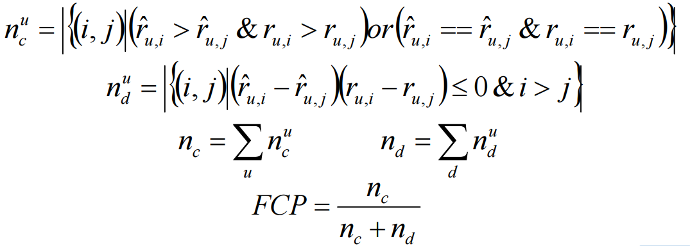

# 回归模型的评价指标
> svm,liner regression,decision regression
## 1. 均方误差(Mean Squared Error,MSE)
观测值与真值偏差的平方和与观测次数的比值：
$$
MSE=\frac{1}{m} \sum_{i=1}^{m}\left(f_{i}-y_{i}\right)^{2}
$$
这就是线性回归中最常用的损失函数，线性回归过程中尽量让该损失函数最小。那么模型之间的对比也可以用它来比较。
MSE可以评价数据的变化程度，MSE的值越小，说明预测模型描述实验数据具有更好的精确度.

## 2. 均方根误差(Root Mean Squard Error，RMSE)
标准误差是均方误差的算术平方根。
标准差是用来衡量一组数自身的离散程度，而均方根误差是用来衡量观测值同真值之间的偏差，它们的研究对象和研究目的不同，但是计算过程类似。
$$
RMSE=\sqrt{\frac{1}{m} \sum_{i=1}^{m}\left(f_{i}-y_{i}\right)^{2}}
$$


## 3. 平均绝对误差(Mean Absolute Error，MAE)
平均绝对误差是绝对误差的平均值 ：
$$MAE=\frac{1}{m} \sum_{i=1}^{m}\left|f_{i}-y_{i}\right|$$
平均绝对误差能更好地反映预测值误差的实际情况.

## 4. R-squared
$$
R^{2}=1-\frac{\sum_{i=1}^{m}\left(f_{i}-y_{i}\right)^{2}}{\sum_{i=1}^{m}\left(\overline{y_{i}}-y_{i}\right)^{2}}
$$

上面分子就是我们训练出的模型预测的误差和。
下面分母就是瞎猜的误差和。（通常取观测值的平均值）

如果结果是0，就说明我们的模型跟瞎猜差不多。
如果结果是1。就说明我们模型无错误。

$R^2$ 介于0~1之间，越接近1，回归拟合效果越好，一般认为超过0.8的模型拟合优度比较高。

# 分类模型的评价指标
> LightGBM,LR,svm二分类
## 1. 混淆矩阵
混淆矩阵是监督学习中的一种可视化工具，主要用于比较分类结果和实例的真实信息。***矩阵中的每一行代表实例的预测类别，每一列代表实例的真实类别。***
- 真正(True Positive , TP)：被模型预测为正的正样本。
- 假正(False Positive , FP)：被模型预测为正的负样本。
- 假负(False Negative , FN)：被模型预测为负的正样本。
- 真负(True Negative , TN)：被模型预测为负的负样本。
----
- 真正率(True Positive Rate,TPR)：TPR=TP/(TP+FN)，即被预测为正的正样本数 /正样本实际数。
- 假正率(False Positive Rate,FPR) ：FPR=FP/(FP+TN)，即被预测为正的负样本数 /负样本实际数。
- 假负率(False Negative Rate,FNR) ：FNR=FN/(TP+FN)，即被预测为负的正样本数 /正样本实际数。
- 真负率(True Negative Rate,TNR)：TNR=TN/(TN+FP)，即被预测为负的负样本数 /负样本实际数


## 2. F1 score
## 3. ROC和AUC(只能用于二分类)

# 多分类模型的评价指标
> knn 多分类

Macro F1: 将n分类的评价拆成n个二分类的评价，计算每个二分类的F1 score，n个F1 score的平均值即为Macro F1。

Micro F1: 将n分类的评价拆成n个二分类的评价，将n个二分类评价的TP、FP、RN对应相加，计算评价准确率和召回率，由这2个准确率和召回率计算的F1 score即为Micro F1。

一般来讲，Macro F1、Micro F1高的分类效果好。Macro F1受样本数量少的类别影响大。

```
from sklearn.metrics import precision_score,recall_score

print (precision_score(y_true, y_scores,average='micro'))

其中average是参数，不同参数适用不同任务，比如二分类，多分类，多标签
```
## 1. 混淆矩阵(多分类)
[sklearn-confusion matrix example](https://scikit-learn.org/stable/auto_examples/model_selection/plot_confusion_matrix.html#sphx-glr-auto-examples-model-selection-plot-confusion-matrix-py)
```
>>> from sklearn.metrics import confusion_matrix
>>> y_true = [2, 0, 2, 2, 0, 1]
>>> y_pred = [0, 0, 2, 2, 0, 2]
>>> confusion_matrix(y_true, y_pred)
array([[2, 0, 0],
       [0, 0, 1],
       [1, 0, 2]])
# 第一行表示，0 预测为 0，0 预测为 1，0 预测为 2 的数量

# 试用seaborn进行可视化
>> import seaborn as sn
>> sn.heatmap(confusion_matrix(y_true, y_pred), annot=True)
	# annot=True，显示各个cell上的数字
```

## 2. 分类报告
```
>>> from sklearn.metrics import classification_report
>>> y_true = [0, 1, 2, 2, 2]
>>> y_pred = [0, 0, 2, 2, 1]
>>> target_names = ['class 0', 'class 1', 'class 2']
>>> print(classification_report(y_true, y_pred, target_names=target_names))
              precision    recall  f1-score   support

     class 0       0.50      1.00      0.67         1
     class 1       0.00      0.00      0.00         1
     class 2       1.00      0.67      0.80         3

    accuracy                           0.60         5
   macro avg       0.50      0.56      0.49         5
weighted avg       0.70      0.60      0.61         5

>>> y_pred = [1, 1, 0]
>>> y_true = [1, 1, 1]
>>> print(classification_report(y_true, y_pred, labels=[1, 2, 3]))
              precision    recall  f1-score   support

           1       1.00      0.67      0.80         3
           2       0.00      0.00      0.00         0
           3       0.00      0.00      0.00         0

   micro avg       1.00      0.67      0.80         3
   macro avg       0.33      0.22      0.27         3
weighted avg       1.00      0.67      0.80         3
```


# 推荐系统
> FP-Growth,协同过滤

## 1. FP-Growth用于发现***频繁项集***的。效率比Apriori算法高

关联分析的第一步就是发现频繁项集，然后根据频繁项集来进一步得到关联关系的支持度和置信度

无监督，无预测过程。
所以，我觉得这个算法组件运行完成后，直接输出结果即可。不需要再接一个模型评估组件了。
比如输出频繁项集，或者关联关系，直接前端展示即可。最多也还可以输出支持度和置信度。

## 2. 协同过滤

### 基于用户的最近邻推荐(user-based nearestneighborecomendation，UserCF)

主要思想是：首先，对输入的评分数据集和当前用户ID作为输入，找出
与当前用户过去有相似偏好的其它用户，这些用户叫做对等用户或者最近邻；然
后，对当前用户没有见过的每个产品p，利用户的近邻对产品p的评分进行预测；
最后，选择所有产品评分最高的TopN个产品推荐给当前用户

### 基于物品的最近邻推荐(item-based nearestneighborecomendation，ItemCF)

ItemCF和UserCF相比，在原理上来讲，只有一个区别：UserCF计算的是用户
之间的相似度，从而是将相似用户喜好的物品推荐给当前用户；ItemCF中计算
的是物品与物品之间的相似度，从而是根据当前用户喜好的物品来推荐其它物品
列表。

----
**所以必须在页面上展示各自的相似度矩阵**
----
推荐系统的运行过程可以看成是一个回归问题或者分类问题，所以可以通过类似的分类/回归相关指标进行衡量，主要包括

- 均方误差(MSE)
- 均方根误差(RMSE)
- 平均绝对误差(MAE) 
- ***一致序列对比率评分(FCP)***
- 准确率(Precison)
- 召回率(Recal)
- ROC曲线（TPR/FPR）
- 覆盖率、 多样性、 新颖性、惊喜度、实时性、商业目标等

补充说明**FCP(一致序列对比率评分)**：Fraction of Concordant Pairs.计算评分一致的物品对在所有物品对中的占比


||推荐	|未推荐|
|-|-|-|
|操作|TP|FN|
|未操作|FP|TN|

- Precision = TP / (TP + FP)
- Recall/真阳率 = TP / (TP + FN)
- 假阳率 = FP / (FP + TN)
- F1 = 2 · Precision · Recall / (Recall + Precision)
- Precision-Recall可以简化成PR曲线,着重于用户喜欢的物品所占的比例
- 真阳率-假阳率可以简化成ROC曲线,着重于被推荐但用户不喜欢的物品的所占比例
- AUC = ROC曲线下面的面积
- 多用户评估
	- 把以上指标求平均值,用于用户可以一直滑动请求数据的场景
	- 对每个用户计算推荐列表长度N的以上指标,然后对每个N求平均值(CROC曲线),用于定长推荐列表的场景
	- 生成的推荐列表,以离线评估数据集整体为参考,计算以上指标(GROC曲线),用于每个用户非定长的场景
- 覆盖率
	- 物品覆盖率,计算被推荐出去的物品所占整体物品的比例(可以根据热度或效用加权);计算基尼系数或者熵
	- 用户覆盖率,该算法可以为多少用户提供推荐(比如冷启动情况下,协同过滤算可能无法给很多用户做推荐)
- 置信区间,惊喜度,新颖度,多样性,效用,信任度,时效,健壮这几个指标,有些比较难算,有些根本不能算